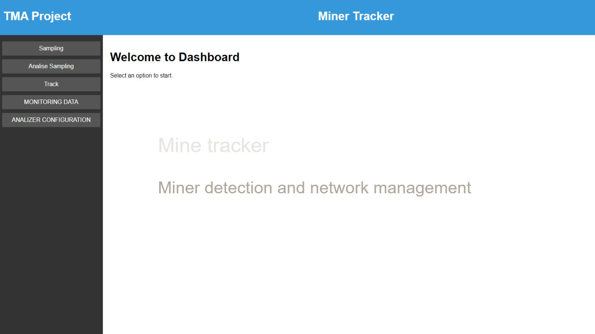
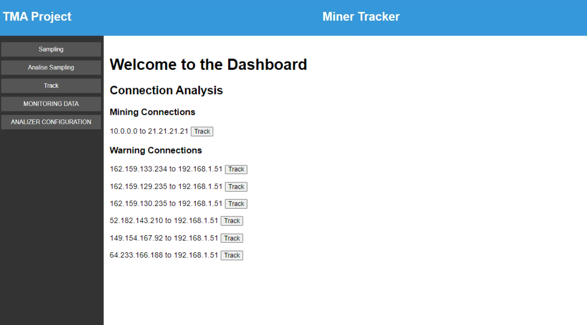
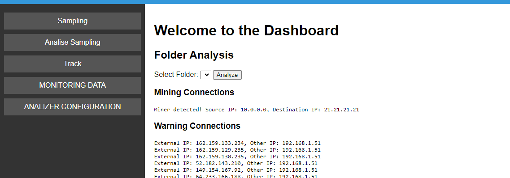
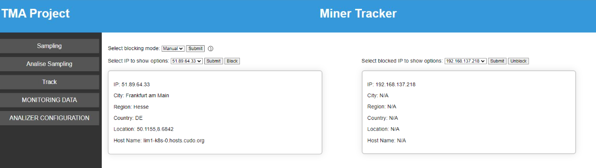
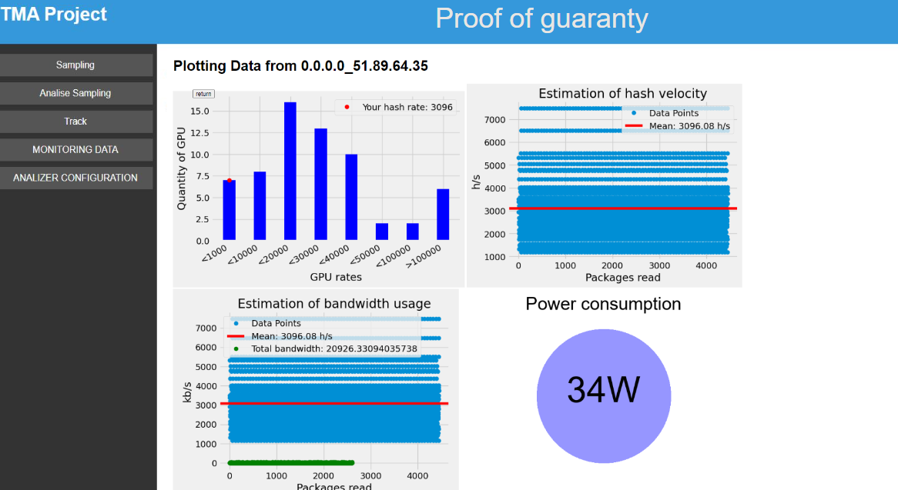

# Minetracker

Minetracker is a miner detection and network management application developed as part of the Traffic and Monitoring Analysis course in the Cybersecurity Master's program at UPC.

## Project Proposal

This project encompasses the following developments:

- Identification of miners that do not exhibit significant CPU usage or are not detectable through conventional virus detection methods.
- Comprehensive analysis of network packets to gather statistical data.

Some existing applications and resources for miner detection include:
- Malwarebytes
- Various guides on inspecting machine processes

Most existing approaches emphasize maintaining control over the machines for effective miner detection.

## Features

Minetracker is designed to be deployed on a router, enabling it to monitor all internet-bound connections.

### Sampling and Analysis

The application allows configuration for packet sampling, including the number of packets sampled, the number of packets saved per sampling file, and the duration of sampling across the network. The primary objective is to detect traces of cryptocurrency miners.

Through the dashboard, users can analyze the packets containing network samples. This analysis identifies suspicious IP connections to miner pools or detects suspected mining traffic. Connections identified as mining or suspicious can be tracked further, allowing for in-depth inspection and evidence gathering related to potential mining activities.

### IP Tracking

Minetracker can analyze external data collected by other means by specifying the folder containing the traffic data. When a folder with data is selected, which is expected to be tracking a connection previously detected during sampling, the application can determine if it has identified a miner. 

If a connection is detected as a miner, the dashboard offers capabilities to find information about the external IP such as city, region, country, geolocation, and host name, which helps end users identify miners. Additionally, users can block any of the IPs or set autoblocking mode on detected miners.

### Data Monitoring

Minetracker's dashboard provides comprehensive data monitoring through four key plots:

1. **Quantity of GPU**:
   - Displays the distribution of GPU rates, indicating the quantity of GPUs operating at various rates.

2. **Estimation of Hash Velocity**:
   - Estimates the hash velocity, showing the mean hash rate (indicated by a red line) and the distribution of data points across different packages read.

3. **Estimation of Bandwidth Usage**:
   - Estimates the bandwidth usage, displaying the mean hash rate (indicated by a red line), total bandwidth (indicated by a green line), and the distribution of data points across different packages read.

4. **Power Consumption**:
   - Represents the power consumption of the system, shown as a single value (34W).

